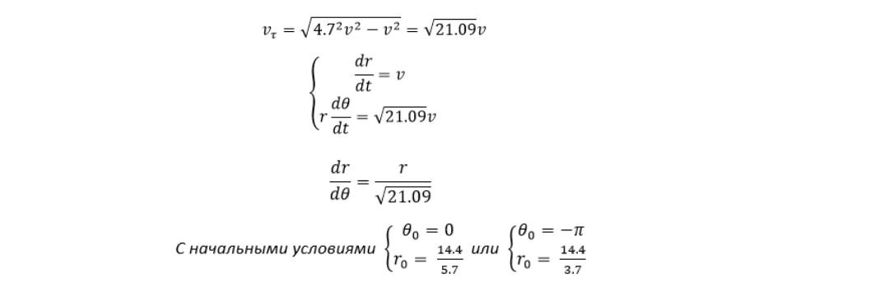
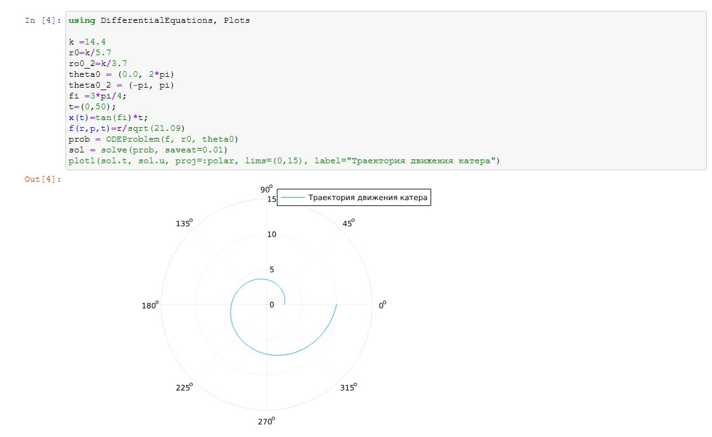
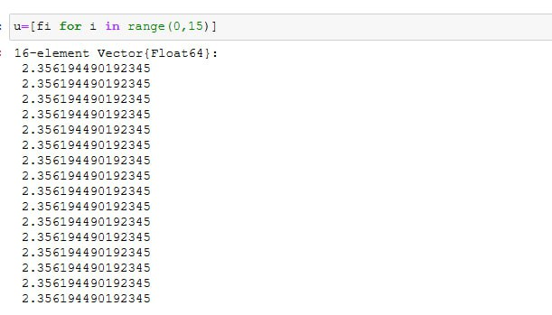
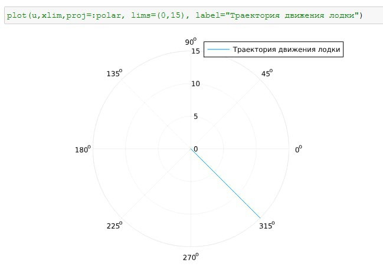
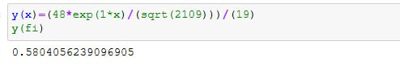
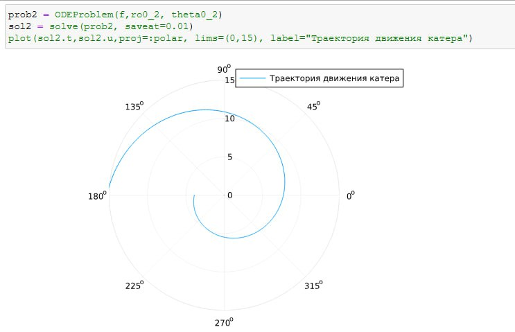
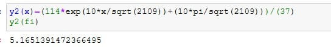

---
## Front matter
title: "Лабораторная работа 2"
subtitle: "Математическое моделирование"
author: "Оразгелдиев Язгелди"

## Generic otions
lang: ru-RU
toc-title: "Содержание"

## Bibliography
bibliography: bib/cite.bib
csl: pandoc/csl/gost-r-7-0-5-2008-numeric.csl

## Pdf output format
toc: true # Table of contents
toc-depth: 2
lof: true # List of figures
lot: true # List of tables
fontsize: 12pt
linestretch: 1.5
papersize: a4
documentclass: scrreprt
## I18n polyglossia
polyglossia-lang:
  name: russian
  options:
	- spelling=modern
	- babelshorthands=true
polyglossia-otherlangs:
  name: english
## I18n babel
babel-lang: russian
babel-otherlangs: english
## Fonts
mainfont: IBM Plex Serif
romanfont: IBM Plex Serif
sansfont: IBM Plex Sans
monofont: IBM Plex Mono
mathfont: STIX Two Math
mainfontoptions: Ligatures=Common,Ligatures=TeX,Scale=0.94
romanfontoptions: Ligatures=Common,Ligatures=TeX,Scale=0.94
sansfontoptions: Ligatures=Common,Ligatures=TeX,Scale=MatchLowercase,Scale=0.94
monofontoptions: Scale=MatchLowercase,Scale=0.94,FakeStretch=0.9
mathfontoptions:
## Biblatex
biblatex: true
biblio-style: "gost-numeric"
biblatexoptions:
  - parentracker=true
  - backend=biber
  - hyperref=auto
  - language=auto
  - autolang=other*
  - citestyle=gost-numeric
## Pandoc-crossref LaTeX customization
figureTitle: "Рис."
tableTitle: "Таблица"
listingTitle: "Листинг"
lofTitle: "Список иллюстраций"
lotTitle: "Список таблиц"
lolTitle: "Листинги"
## Misc options
indent: true
header-includes:
  - \usepackage{indentfirst}
  - \usepackage{float} # keep figures where there are in the text
  - \floatplacement{figure}{H} # keep figures where there are in the text
---

# Цель работы

Построить математическую модель решения задачи о погоне

# Задание

На море в тумане катер береговой охраны преследует лодку браконьеров.
Через определенный промежуток времени туман рассеивается, и лодка
обнаруживается на расстоянии k км от катера. Затем лодка снова скрывается в
тумане и уходит прямолинейно в неизвестном направлении. Известно, что скорость
катера в 2 раза больше скорости браконьерской лодки.
1. Записать уравнение, описывающее движение катера с началным условием 2-х случае
2. Построить траекторию движения катера и лодки
3. Найти точку пересечения катера и лодки

# Выполнение лабораторной работы

Мой вариант 36
. 
Введем полярные координаты. Считаем, что полюс - это точка обнаружения лодки браконьеров. xл0, а полярная ось r
проходит через точку нахождения катера береговой охраны

Траектория катера должна быть такой, чтобы и катер, и лодка все время были на одном расстоянии от полюса, только в этом случае траектория катера пересечется с траекторией лодки. Поэтому для начала катер береговой охраны должен двигаться некоторое время прямолинейно, пока не окажется на том же расстоянии от полюса, что
и лодка браконьеров. После этого катер береговой охраны должен двигаться вокруг полюса удаляясь от него с той же скоростью, что и лодка браконьеров.

Чтобы найти расстояние x (расстояние после которого катер начнет двигаться вокруг полюса), необходимо составить простое уравнение. Пусть через время t катер и лодка окажутся на одном расстоянии x от полюса. За
это время лодка пройдет x, а катер k-x  (или k + x , в зависимости от начального положения катера относительно полюса). Время, за которое они пройдут это расстояние, вычисляется как x/v или k - x/ 2v. Так как время одно и то же, то эти величины одинаковы. Тогда неизвестное расстояние x можно найти из следующего уравнения

{#fig:001 width=70%}

После того, как катер береговой охраны окажется на одном расстоянии от полюса, что и лодка, он должен сменить прямолинейную траекторию и начать двигаться вокруг полюса удаляясь от него со скоростью лодки v . Для этого скорость катера раскладываем на две составляющие: радиальная скорость и тангенциальная скорость. Радиальная
скорость - это скорость, с которой катер удаляется от полюса. Нам нужно, чтобы эта скорость была равна скорости лодки, поэтому полагаем, что dr/dt=v. Тангенциальная скорость – это линейная скорость вращения катера
относительно полюса. Она равна произведению угловой скорости d0/d0 на радиус. Решение исходной задачи сводится к решению системы из двух дифференциальных уравнений:

{#fig:002 width=70%}

Построил траекторию движения катера и лодки для первого случая

{#fig:003 width=70%}

{#fig:004 width=70%}

{#fig:005 width=70%}

{#fig:006 width=70%}

Нашли точку пересечения траектории катера и лодки для 1-го случая. Для этого прописали функцию, которая является решение диффур.

{#fig:007 width=70%}

Построил траекторию движения катера и лодки для 2-го случая

{#fig:008 width=70%}

{#fig:009 width=70%}

Нашли точку пересечения траектории катера и лодки для 2-го случая

{#fig:010 width=70%}

# Выводы

В ходе работы я построил математическую модель решения задачи о погоне
