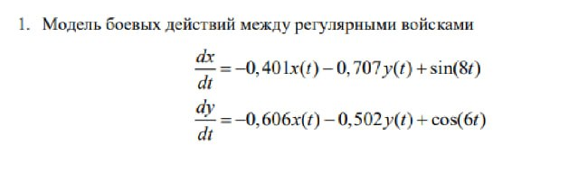
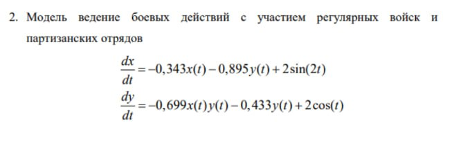
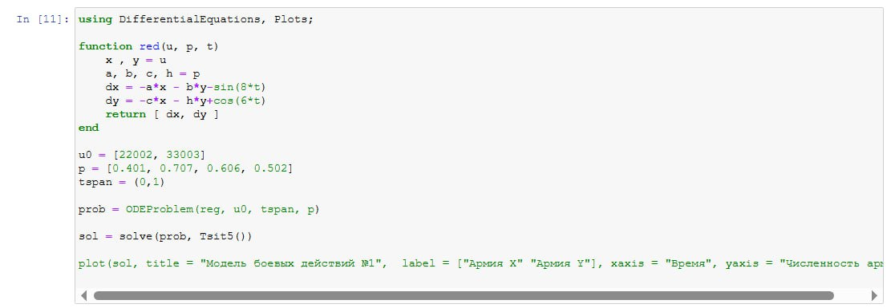
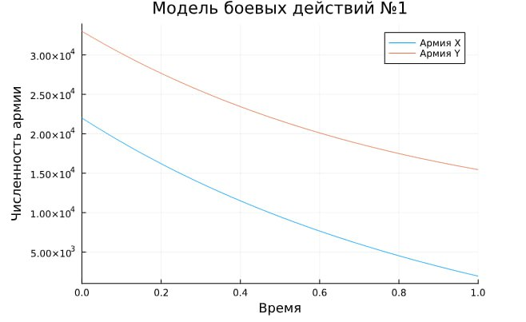
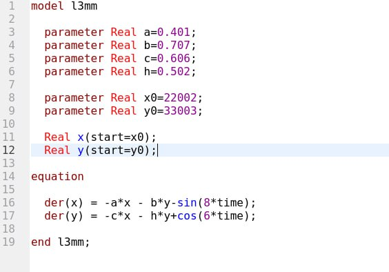
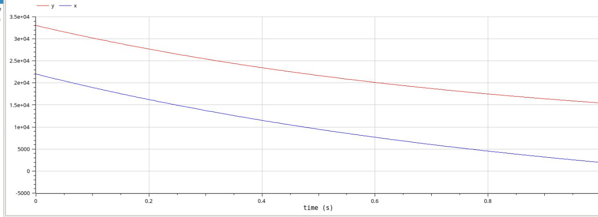
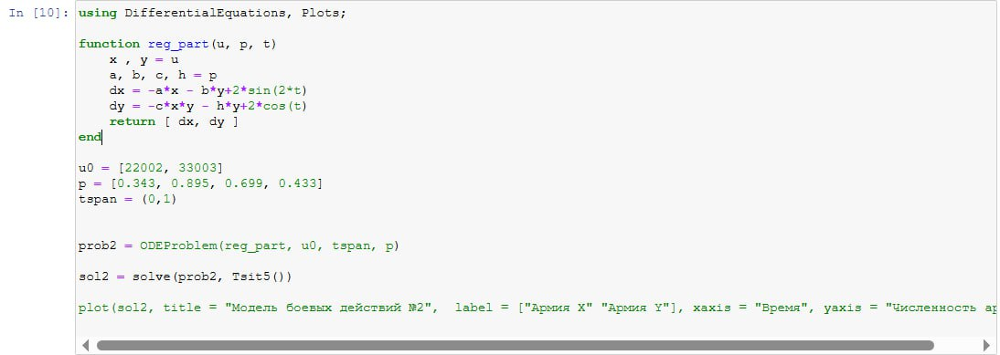
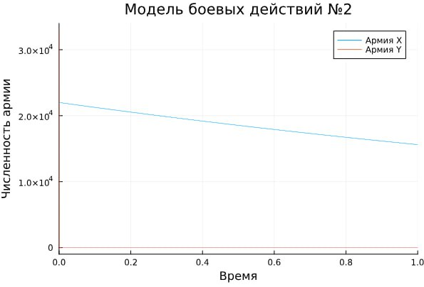
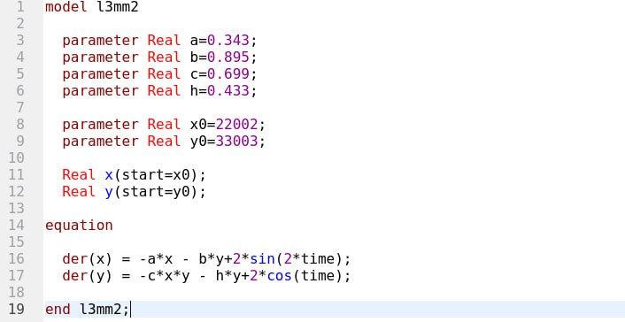
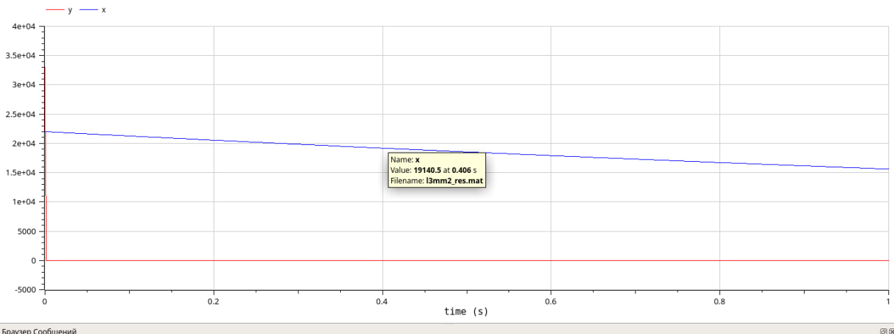

---
## Front matter
title: "Лабораторная работа 3"
subtitle: "Математическое моделирование"
author: "Оразгелдиев Язгелди"

## Generic otions
lang: ru-RU
toc-title: "Содержание"

## Bibliography
bibliography: bib/cite.bib
csl: pandoc/csl/gost-r-7-0-5-2008-numeric.csl

## Pdf output format
toc: true # Table of contents
toc-depth: 2
lof: true # List of figures
lot: true # List of tables
fontsize: 12pt
linestretch: 1.5
papersize: a4
documentclass: scrreprt
## I18n polyglossia
polyglossia-lang:
  name: russian
  options:
	- spelling=modern
	- babelshorthands=true
polyglossia-otherlangs:
  name: english
## I18n babel
babel-lang: russian
babel-otherlangs: english
## Fonts
mainfont: IBM Plex Serif
romanfont: IBM Plex Serif
sansfont: IBM Plex Sans
monofont: IBM Plex Mono
mathfont: STIX Two Math
mainfontoptions: Ligatures=Common,Ligatures=TeX,Scale=0.94
romanfontoptions: Ligatures=Common,Ligatures=TeX,Scale=0.94
sansfontoptions: Ligatures=Common,Ligatures=TeX,Scale=MatchLowercase,Scale=0.94
monofontoptions: Scale=MatchLowercase,Scale=0.94,FakeStretch=0.9
mathfontoptions:
## Biblatex
biblatex: true
biblio-style: "gost-numeric"
biblatexoptions:
  - parentracker=true
  - backend=biber
  - hyperref=auto
  - language=auto
  - autolang=other*
  - citestyle=gost-numeric
## Pandoc-crossref LaTeX customization
figureTitle: "Рис."
tableTitle: "Таблица"
listingTitle: "Листинг"
lofTitle: "Список иллюстраций"
lotTitle: "Список таблиц"
lolTitle: "Листинги"
## Misc options
indent: true
header-includes:
  - \usepackage{indentfirst}
  - \usepackage{float} # keep figures where there are in the text
  - \floatplacement{figure}{H} # keep figures where there are in the text
---

# Цель работы

Реализовать модель боевых действий на языках Julia и OpenModelica

# Задание

Между страной Х и страной У идет война. Численность состава войск
исчисляется от начала войны, и являются временными функциями x(t) и y(t). Для упрощения модели считаем, что коэффициенты a, b, c,  h постоянны. Также считаем P(t) и Q(t) непрерывные функции. Построить графики изменения численности войск армии Х и армии У для следующих случаев

{#fig:001 width=70%}

{#fig:002 width=70%}

# Выполнение лабораторной работы

Написал программу для построения графика модели боевых действий между регулярными войсками на языке Julia. По итогу получаем, что выигрывает армия У

{#fig:003 width=70%}

{#fig:004 width=70%}

Написал программу для построения графика модели боевых действий между регулярными войсками на языке OpenModelica. Результаты совпадает с прошлым рисунком

{#fig:005 width=70%}

{#fig:006 width=70%}

Далее мы напишем программу уже для второго случая - графика модели боевых действий между регулярными войсками и партизанами

Сначала напишем код на языке Julia , а потом в OpenModelica

{#fig:007 width=70%}

{#fig:008 width=70%}

По рисунку(графику) видно, что побеждает армия Х, а численность армии У падает до 0 почти с самого начала и моментально

Далее мы реализуем этот же график в OpenModelica. Результата идентичен

{#fig:009 width=70%}

{#fig:010 width=70%}

# Выводы

Я реализовал модель боевых действий на языке Julia , а потом и в OpenModelica.
